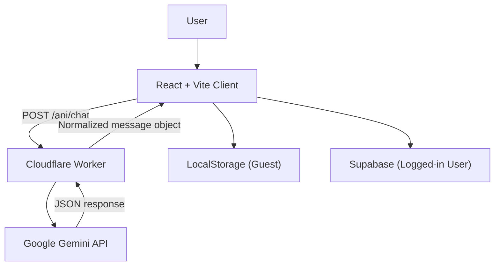

# V-MATE

캐릭터의 **겉말(response)** 과 **속마음(inner_heart)** 을 분리해 보여주는 웹 기반 AI 캐릭터 채팅 프로젝트입니다.

---

## 핵심 흐름



---

## 현재 구현 기능

- **Dual Psychology 출력**: `emotion`, `inner_heart`, `response` (+ `narration` optional)
- **표정 변화 연출**: assistant emotion이 바뀌는 턴에 일러스트 카드 표시
- **상황 설명 텍스트**: `narration`을 대사 버블과 분리 렌더
- **하이브리드 저장**:
  - 비로그인: LocalStorage
  - 로그인: Supabase `chat_messages` 테이블
- **URL 기반 화면 분리**: `/`(홈), `/chat/:characterId`(채팅)
- **서버리스 프록시**: Gemini API Key는 Cloudflare Worker에서만 사용
- **모델 고정**: `gemini-3-flash-preview` 사용 (서버 코드 고정)
- **조건부 복구 재시도**: 동일 모델에서 cache lookup 실패/네트워크 실패 시 복구 재시도(설정값으로 제어)
- **Gemini Context Cache 재사용**: 캐릭터별 시스템 프롬프트 캐시를 `cachedContent`로 재사용해 재요청 비용 절감
- **Context Cache 신뢰 경계 강화**: 클라이언트가 보낸 `cachedContent`는 서버가 가진 동일 prompt cache key 항목과 일치할 때만 사용
- **JSON Mode 요청**: `responseMimeType: "application/json"`
- **Origin allowlist CORS**: `ALLOWED_ORIGINS` 기반 허용
- **Worker 엣지 선차단**: disallowed origin/oversized body를 Worker 레벨에서 먼저 차단(403/413)
- **Cloud Run 어댑터 가드레일**: `/api/chat` 응답에 CORS/trace/no-store 기본 헤더를 보장
- **요청 제한**: Origin/IP 키 기반 rate limit 적용
- **요청 제한 가시성**: 모든 chat 응답에 `X-V-MATE-RateLimit-*` 헤더 노출
- **요청 중복 억제(dedupe)**: `clientRequestId + payload fingerprint` 기반으로 재시도/중복 클릭 요청을 단일 처리하고 `X-V-MATE-Dedupe-Status`(`fresh|replay|inflight|bypass`) 헤더로 상태 노출
- **응답 정규화**: 서버에서 `emotion / inner_heart / response`(+ `narration` optional) 스키마 보정 후 반환
- **서버 프롬프트 소유**: `server/prompts.js`에서 캐릭터별 시스템 프롬프트 관리 (클라이언트 전송 제거)
- **핵심 오케스트레이션 분리**: `server/modules/gemini-orchestrator.js`로 모델 호출/복구 재시도 흐름 분리
- **UI 리프레시**: 홈/채팅 화면 글래스모피즘+그라디언트 기반 시각 개선
- **번들 로딩 최적화**: Supabase SDK를 초기 modulepreload에서 제외해 초기 진입 로딩 부담 완화
- **Supabase SDK 지연 초기화**: `resolveSupabaseClient()` 호출 시점에만 SDK를 동적 import하여 비로그인 경로 비용 최소화
- **Supabase 히스토리 모듈 지연 로드**: 로그인 사용자 경로에서만 `historySupabaseStore`를 동적 import
- **Auth 초기화 지연**: 저장된 Supabase 세션이 있거나 Auth UI 진입 시에만 auth listener 초기화
- **히스토리 조회 스캔 상한**: Supabase recent/preview 조회는 정렬 + limit 기반으로 bounded scan 수행
- **개인정보 최소 노출**: 홈 프로필 드롭다운의 이메일은 마스킹된 형태로 표시
- **캐릭터 이미지 경량화**: PNG 자산을 WebP로 전환해 초기/반복 로딩 payload 절감
- **브라우저 저장소 안전화**: localStorage 비가용 환경에서도 guest/prompt cache 로직이 안전하게 fallback
- **논블로킹 대화 초기화 확인**: `window.confirm` 대신 모달 다이얼로그 기반 초기화 확인 UX

---

## 프론트 레퍼런스 사용 원칙 (IDEAHUB pattern-only)

- 레이아웃/톤/모션 아이디어는 pattern-only로 재해석하여 사용
- 원본 프로젝트의 브랜드 자산/문구/코드를 그대로 복제하지 않음
- 참고 provenance:
  - https://github.com/Animmaster/Obys-clone
  - https://github.com/Animmaster/StreamVibe
  - https://github.com/Animmaster/site-unixstudio

---

## 빠른 시작

### 0) 런타임 요구사항

- Node.js 20 이상 권장 (CI 기준 Node.js 20)
- `.nvmrc` 포함: `nvm use`로 권장 버전 자동 적용 가능

### 1) 의존성 설치

```bash
npm install
```

### 2) 환경 변수

프로젝트 루트 `.env` 파일:

```env
# Client
VITE_SUPABASE_URL=...
VITE_SUPABASE_ANON_KEY=...
VITE_SUPABASE_PUBLISHABLE_KEY=...
VITE_CHAT_API_BASE_URL=

# Cloudflare Worker Secret/Vars
GOOGLE_API_KEY=...

# Optional
GEMINI_HISTORY_MESSAGES=10
GEMINI_MAX_PART_CHARS=700
GEMINI_MAX_SYSTEM_PROMPT_CHARS=5000
GEMINI_MAX_OUTPUT_TOKENS=1024
GEMINI_MODEL_TIMEOUT_MS=15000
FUNCTION_TOTAL_TIMEOUT_MS=20000
FUNCTION_TIMEOUT_GUARD_MS=1500
GEMINI_CONTEXT_CACHE_ENABLED=true
GEMINI_CONTEXT_CACHE_TTL_SECONDS=21600
GEMINI_CONTEXT_CACHE_CREATE_TIMEOUT_MS=1800
GEMINI_CONTEXT_CACHE_WARMUP_MIN_CHARS=1200
GEMINI_CONTEXT_CACHE_AUTO_CREATE=false
GEMINI_CACHE_LOOKUP_RETRY_ENABLED=true
GEMINI_NETWORK_RECOVERY_RETRY_ENABLED=true
GEMINI_EMPTY_RESPONSE_RETRY_ENABLED=false
GEMINI_THINKING_LEVEL=minimal
ALLOWED_ORIGINS=http://localhost:5173,https://your-domain.com
ALLOW_ALL_ORIGINS=false
RATE_LIMIT_WINDOW_MS=60000
RATE_LIMIT_MAX_REQUESTS=30
RATE_LIMIT_MAX_KEYS=5000
ALLOW_NON_BROWSER_ORIGIN=false
REQUEST_BODY_MAX_BYTES=32768
TRUST_X_FORWARDED_FOR=false
TRUST_PROXY_HEADERS=false
REQUIRE_JSON_CONTENT_TYPE=false
PROMPT_CACHE_MAX_ENTRIES=256
RATE_LIMIT_STORE=memory
PROMPT_CACHE_STORE=memory
RATE_LIMIT_KV_PREFIX=v-mate:rl:
PROMPT_CACHE_KV_PREFIX=v-mate:pc:
CLIENT_REQUEST_DEDUPE_WINDOW_MS=15000
CLIENT_REQUEST_DEDUPE_MAX_ENTRIES=2000
LOG_LEVEL=info
```

### 3) DB 초기화

Supabase SQL Editor에서 `supabase_schema.sql` 실행

### 4) 로컬 실행

```bash
npm run dev
```

Cloudflare Worker 로컬 확인:

```bash
npm run cf:dev
```

품질 검증:

```bash
npm run typecheck
npm test
npm run build
# 또는 한 번에
npm run verify
```

---

## 설정 메모

- 기본 히스토리 윈도우: `GEMINI_HISTORY_MESSAGES` (기본 10)
- 프론트 전송 히스토리 상한: 최근 30개 메시지(`useChatViewController` 클라이언트 상한)
- 프론트 입력 최대 길이: 1200자(`ChatComposer` textarea maxLength)
- 모델: `gemini-3-flash-preview` 고정 (모델 fallback 없음)
- 모델 최대 출력 토큰: `GEMINI_MAX_OUTPUT_TOKENS` (기본 1024)
- 동일 모델 복구 재시도:
  - `GEMINI_CACHE_LOOKUP_RETRY_ENABLED` (기본 true)
  - `GEMINI_NETWORK_RECOVERY_RETRY_ENABLED` (기본 true)
  - `GEMINI_EMPTY_RESPONSE_RETRY_ENABLED` (기본 false)
- 시스템 프롬프트 최대 길이: `GEMINI_MAX_SYSTEM_PROMPT_CHARS` (기본 5000)
- 요청 파트 최대 길이: `GEMINI_MAX_PART_CHARS` (기본 700)
- 모델 요청 타임아웃: `GEMINI_MODEL_TIMEOUT_MS` (기본 15000ms)
- Worker 함수 총 실행 예산: `FUNCTION_TOTAL_TIMEOUT_MS` (기본 20000ms)
- 함수 종료 가드: `FUNCTION_TIMEOUT_GUARD_MS` (기본 1500ms)
- Gemini Context Cache: `GEMINI_CONTEXT_CACHE_ENABLED` (기본 true)
- Context Cache TTL: `GEMINI_CONTEXT_CACHE_TTL_SECONDS` (기본 21600초)
- Cache 생성 타임아웃: `GEMINI_CONTEXT_CACHE_CREATE_TIMEOUT_MS` (기본 1800ms)
- Cache 워밍 기준 길이: `GEMINI_CONTEXT_CACHE_WARMUP_MIN_CHARS` (기본 1200자)
- Cache 자동 생성: `GEMINI_CONTEXT_CACHE_AUTO_CREATE` (코드 기본 false, `wrangler.jsonc` 샘플 값 true)
- Gemini thinking level: `GEMINI_THINKING_LEVEL` (`minimal|low|medium|high`, 기본 `minimal`)
- 기본 Rate Limit: 60초당 30회(`RATE_LIMIT_WINDOW_MS`, `RATE_LIMIT_MAX_REQUESTS`)
- rate-limit key 저장 최대 개수: `RATE_LIMIT_MAX_KEYS` (기본 `5000`)
- CORS는 기본적으로 `ALLOWED_ORIGINS` 기반 허용
- Origin 없는 호출 허용 여부: `ALLOW_NON_BROWSER_ORIGIN` (기본 `false`)
- 요청 body 최대 크기: `REQUEST_BODY_MAX_BYTES` (기본 `32768`)
- `X-Forwarded-For` 신뢰 여부: `TRUST_X_FORWARDED_FOR` (기본 `false`)
- 프록시 IP 헤더 신뢰 여부: `TRUST_PROXY_HEADERS` (기본 `false`)
  - `false`면 `CF-Ray`가 함께 온 `CF-Connecting-IP`만 신뢰(Cloudflare 경유)
  - `true`면 `CF-Connecting-IP`/`X-Real-IP`(+ `TRUST_X_FORWARDED_FOR=true` 시 `X-Forwarded-For`) 사용
- JSON Content-Type 강제 여부: `REQUIRE_JSON_CONTENT_TYPE` (기본 `false`, `true`면 `Content-Type: application/json` 이외 요청은 `415`)
- prompt cache 최대 엔트리 수: `PROMPT_CACHE_MAX_ENTRIES` (기본 `256`)
- rate-limit 저장소 모드: `RATE_LIMIT_STORE` (`memory|kv`, 기본 `memory`)
- prompt-cache 저장소 모드: `PROMPT_CACHE_STORE` (`memory|kv`, 기본 `memory`)
- KV 키 prefix(선택): `RATE_LIMIT_KV_PREFIX`, `PROMPT_CACHE_KV_PREFIX`
  - prefix를 지정하지 않으면 각각 `v-mate:rl:`, `v-mate:pc:`를 사용합니다.
- 클라이언트 요청 중복억제(선택): `CLIENT_REQUEST_DEDUPE_WINDOW_MS` (기본 `15000`), `CLIENT_REQUEST_DEDUPE_MAX_ENTRIES` (기본 `2000`)
  - 동일 `clientRequestId` + 동일 요청 fingerprint(캐릭터/메시지/히스토리/cachedContent)이면 dedupe window 내에서 성공 응답을 재사용합니다.
- 서버 로그 레벨: `V_MATE_LOG_LEVEL` 또는 `LOG_LEVEL` (`silent|error|warn|info|debug`, 운영 기본 `warn`, 개발 기본 `info`)
- (선택) 커스텀 rate-limit 훅: `createWorker`/`createCloudRunServer`에서 `chatHandlerContext.checkRateLimit` 주입 가능
  - 반환 형식: `{ allowed: boolean, remaining?: number, retryAfterMs?: number, limit?: number }`
  - `remaining`/`retryAfterMs`를 함께 반환하면 기본 인메모리 limiter fallback 호출 없이 커스텀 값만 사용합니다.
- (선택) 커스텀 prompt-cache 훅: `chatHandlerContext.promptCache` (`get/set/remove`) 주입 가능
  - `get(key)` 반환 예시: `{ name: "cachedContents/...", expireAtMs: 1735689600000 }`
- Worker에서 KV 사용(선택):
  - `RATE_LIMIT_STORE=kv` + KV 바인딩(`V_MATE_RATE_LIMIT_KV` 또는 `RATE_LIMIT_KV`)으로 분산 rate-limit 훅 자동 활성화
  - `PROMPT_CACHE_STORE=kv` + KV 바인딩(`V_MATE_PROMPT_CACHE_KV` 또는 `PROMPT_CACHE_KV`)으로 분산 prompt-cache 훅 자동 활성화
- `chatHandlerContext`가 함수일 때 반환값이 객체가 아니거나 resolver에서 예외가 발생하면, 런타임은 안전하게 `{}` 컨텍스트로 fallback합니다.
- chat 응답에는 기본적으로 `Cache-Control: no-store, max-age=0`, `Pragma: no-cache`, `X-Content-Type-Options: nosniff`가 포함됩니다.
- 클라이언트에서 service role key 감지 시 Supabase를 비활성화하고 placeholder client로 대체
- API 실패/파싱 실패 시 캐릭터별 fallback 대사 출력(클라이언트 레벨 유지)

### Chat API v2 계약 (기본)

- 요청:
  - `characterId`: `mika | alice | kael`
  - `userMessage`: string (1~1200 chars)
  - `messageHistory`: `{ role, content }[]` (max 50 items, each content max 1200 chars)
  - `cachedContent?`: string (max 256 chars, `cachedContents/...` 형식)
  - `clientRequestId?`: string (1-64, `[A-Za-z0-9._:-]`)
  - 메서드 정책: `POST`만 허용 (`OPTIONS` preflight 허용, 그 외 `405 METHOD_NOT_ALLOWED`)
  - `405` 응답에는 `Allow: POST, OPTIONS` 헤더 포함
- 응답:
  - `message`: `{ emotion, inner_heart, response, narration? }`
  - `cachedContent`: `string | null`
  - `trace_id`: string
- 에러 응답(공통):
  - `{ error, error_code, trace_id, retryable? }`
  - 주요 코드: `ORIGIN_NOT_ALLOWED`, `METHOD_NOT_ALLOWED`, `REQUEST_BODY_TOO_LARGE`, `UNSUPPORTED_CONTENT_TYPE`, `RATE_LIMIT_EXCEEDED`

#### 에러 코드 레퍼런스 (운영 기준)

| error_code | HTTP | retryable | 의미 |
|---|---:|:---:|---|
| `ORIGIN_NOT_ALLOWED` | 403 | N | 허용되지 않은 Origin 요청 |
| `METHOD_NOT_ALLOWED` | 405 | N | `POST/OPTIONS` 외 메서드 |
| `REQUEST_BODY_TOO_LARGE` | 413 | N | 요청 본문 크기 제한 초과 |
| `UNSUPPORTED_CONTENT_TYPE` | 415 | N | JSON Content-Type 정책 위반 |
| `INVALID_REQUEST_BODY` | 400 | N | JSON 파싱 실패/객체 형태 아님 |
| `INVALID_CHARACTER_ID` | 400 | N | 지원하지 않는 캐릭터 ID |
| `INVALID_USER_MESSAGE` | 400 | N | 메시지 누락/길이 제한 위반 |
| `INVALID_MESSAGE_HISTORY` | 400 | N | 히스토리 형식/길이 제한 위반 |
| `INVALID_CACHED_CONTENT` | 400 | N | cachedContent 형식/길이 제한 위반 |
| `INVALID_CLIENT_REQUEST_ID` | 400 | N | clientRequestId 형식 위반 |
| `RATE_LIMIT_EXCEEDED` | 429 | Y | 요청 횟수 제한 초과 |
| `UPSTREAM_CONNECTION_FAILED` | 503 | Y | Gemini upstream 연결 실패 |
| `UPSTREAM_TIMEOUT` | 504 | Y | Gemini upstream 타임아웃 |
| `FUNCTION_BUDGET_TIMEOUT` | 504 | Y | 함수 실행 예산 내 응답 불가 |
| `UPSTREAM_INVALID_FORMAT` | 502 | N | 모델 응답 계약(JSON) 불일치 |
| `UPSTREAM_MODEL_ERROR` | 5xx | N | Gemini 모델 응답 에러 |
| `INTERNAL_SERVER_ERROR` | 500 | N | 서버 내부 오류 |

호환 목적의 v1 응답(`text` JSON string)은 `X-V-MATE-API-Version: 1` 헤더로 요청 시 유지됩니다.

프론트는 `src/lib/chat/chatContract.ts`의 상수(`userMessageMaxChars`, `historyMaxItems` 등)를 기준으로 입력/요청 payload를 사전 정규화합니다.

- 공통 응답 헤더:
  - `X-V-MATE-Error-Code` (에러 응답에서 포함)
  - `X-V-MATE-Dedupe-Status` (`fresh | replay | inflight | bypass`)
  - `X-V-MATE-RateLimit-Limit`
  - `X-V-MATE-RateLimit-Remaining`
  - `X-V-MATE-RateLimit-Reset` (초)
  - `Access-Control-Expose-Headers`에 `X-V-MATE-Trace-Id`, `X-V-MATE-API-Version`, `X-V-MATE-Elapsed-Ms`, `X-V-MATE-Error-Code`, `X-V-MATE-Dedupe-Status`, `X-V-MATE-RateLimit-*`, `Retry-After`, `X-V-MATE-Client-Request-Id` 포함

### Cloud Run 백엔드 사용 시 (권장)

- `VITE_CHAT_API_BASE_URL`에 Cloud Run 서비스 URL을 넣으면 프론트가 Worker 대신 Cloud Run `/api/chat`로 직접 호출합니다.
  - 예: `VITE_CHAT_API_BASE_URL=https://v-mate-chat-xxxxx-uc.a.run.app`
- Cloud Run의 `ALLOWED_ORIGINS`에는 최소 아래를 포함하세요:
  - `https://v-mate.jeonsavvy.workers.dev`
  - `http://localhost:5173`
  - `http://127.0.0.1:5173`

---

## 캐릭터 프롬프트 수정 가이드

- 서버 프롬프트 파일: `server/prompts.js`
- `src/lib/data.ts`에서는 캐릭터 메타/이미지/인사말만 유지합니다.
- 출력 계약은 `emotion`, `inner_heart`, `response` 필수 + `narration` 선택 스키마를 사용합니다.

---

## 주의사항 (현재 상태)

- 운영 중 CORS 긴급 완화가 필요하면 `ALLOW_ALL_ORIGINS=true`로 일시 완화할 수 있습니다(기본값은 `false` 권장).
- 대화 히스토리 기본값은 10이며, `GEMINI_HISTORY_MESSAGES`로 조정할 수 있습니다.

---

## Cloudflare 배포

```bash
npm run cf:deploy
```

- 배포 설정: `wrangler.jsonc`
- Worker 엔트리: `worker.js`

---

## 운영 릴리즈/롤백 체크리스트

### 배포 전

```bash
npm run verify
```

- `ALLOWED_ORIGINS`, `ALLOW_NON_BROWSER_ORIGIN`, `ALLOW_ALL_ORIGINS` 운영값 확인
- `GOOGLE_API_KEY` Secret 주입 확인
- `REQUEST_BODY_MAX_BYTES`, `RATE_LIMIT_*` 운영 정책 확인

### 배포 후 스모크

1. `GET /healthz` -> `200`
2. 허용 Origin에서 `/api/chat` 정상 응답 + `X-V-MATE-Trace-Id` 확인
3. 비허용 Origin에서 `/api/chat` -> `403 ORIGIN_NOT_ALLOWED`
4. 과대 요청 본문 -> `413 REQUEST_BODY_TOO_LARGE`

### 롤백

- **Cloudflare Worker**: 직전 정상 배포 버전으로 재배포 (`wrangler deployments` / `wrangler rollback`)
- **Cloud Run**: 직전 revision으로 트래픽 즉시 전환
- 롤백 후 `healthz`, `POST /api/chat` 1회 검증 필수
- 채팅 API: `/api/chat`
- `GOOGLE_API_KEY`는 Cloudflare secret으로 등록:

```bash
npx --yes wrangler@4.67.0 secret put GOOGLE_API_KEY
```

## Cloud Run 배포 (Gemini 지역 제한 회피용)

1) Google Secret Manager에 Gemini 키 저장

```bash
gcloud secrets create GEMINI_API_KEY --replication-policy="automatic"
printf '%s' 'YOUR_GEMINI_API_KEY' | gcloud secrets versions add GEMINI_API_KEY --data-file=-
```

2) Cloud Run 배포

```bash
gcloud run deploy v-mate-chat \
  --source . \
  --region us-central1 \
  --allow-unauthenticated \
  --set-secrets GOOGLE_API_KEY=GEMINI_API_KEY:latest \
  --set-env-vars ALLOWED_ORIGINS=https://v-mate.jeonsavvy.workers.dev,http://localhost:5173,http://127.0.0.1:5173,ALLOW_ALL_ORIGINS=false,ALLOW_NON_BROWSER_ORIGIN=false,REQUEST_BODY_MAX_BYTES=32768,TRUST_PROXY_HEADERS=false,TRUST_X_FORWARDED_FOR=false
```

3) 프론트 `.env`에 Cloud Run URL 연결 후 재배포

```env
VITE_CHAT_API_BASE_URL=https://<your-cloud-run-url>
```

## 디렉터리

```bash
├── server/chat-handler.js
├── server/chat-handler.test.js
├── server/cloud-run-server.js
├── server/cloud-run-server.test.js
├── worker.js
├── worker.test.js
├── server/modules/
│   ├── runtime-config.js
│   ├── http-policy.js
│   ├── http-response.js
│   ├── request-schema.js
│   ├── prompt-cache.js
│   ├── gemini-client.js
│   ├── gemini-orchestrator.js
│   ├── upstream-error-map.js
│   └── response-normalizer.js
├── wrangler.jsonc
├── src/components/
│   ├── home/
│   │   ├── HomeHeaderBar.tsx
│   │   ├── HomeHeroSection.tsx
│   │   ├── HomeStoryFlowSection.tsx
│   │   ├── HomeCuratedPicksSection.tsx
│   │   └── HomeCharacterBrowseSection.tsx
│   └── chat/
│       ├── CharacterSidebar.tsx
│       ├── ChatTopBar.tsx
│       ├── CharacterInfoMobile.tsx
│       ├── CharacterInfoDesktop.tsx
│       ├── MessageTimeline.tsx
│       └── ChatComposer.tsx
├── src/hooks/
│   ├── chat/
│   │   ├── useChatActions.ts
│   │   ├── useChatLifecycle.ts
│   │   └── useChatViewport.ts
│   ├── useHomeController.ts
│   ├── useChatSession.ts
│   └── useChatViewController.ts
├── src/lib/
│   └── chat/
│       ├── apiClient.ts
│       ├── chatContract.ts
│       ├── historyRepository.ts
│       ├── historyContent.ts
│       ├── historyGuestStore.ts
│       ├── historySupabaseStore.ts
│       ├── historyTypes.ts
│       ├── greetingMessage.ts
│       ├── messagePresentation.ts
│       ├── errorPersona.ts
│       └── sidebarEntries.ts
├── server/prompts.js
├── supabase_schema.sql
└── README.md
```

## CI

- GitHub Actions: `.github/workflows/ci.yml`
- 트리거: `push(main/master)`, `pull_request`
- 실행: `npm run verify` (typecheck + test + build)
