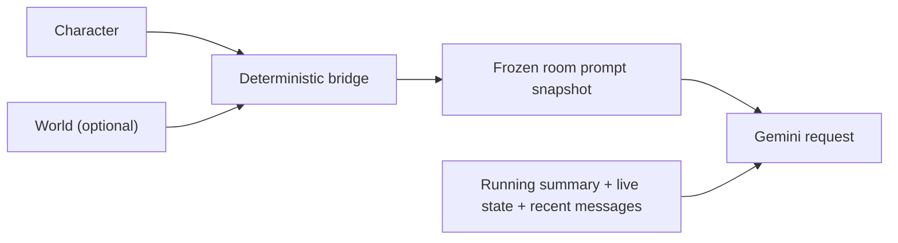

# V-MATE

V-MATE는 캐릭터와 월드를 선택해 하나의 대화방을 만드는 서사형 캐릭터챗 플랫폼입니다. React/Vite 프론트엔드, Cloudflare Worker, Supabase Database/Storage, Gemini API로 구성됩니다.

## 핵심 개념

- **character**: 성격, 말투, 관계의 출발점, 캐릭터 이미지 슬롯
- **world**: 장면 규칙, 분위기, 시작 위치, 월드 이미지 슬롯
- **room**: 선택한 캐릭터와 월드로 만든 플레이 세션, 메시지와 상태의 소유 단위

월드는 선택 사항이고 캐릭터는 필수입니다. 별도의 캐릭터-월드 연결 테이블은 없으므로 접근 가능한 캐릭터와 월드를 임의로 조합할 수 있습니다.


```mermaid
flowchart LR
  C["Character"] --> B["Deterministic bridge"]
  W["World (optional)"] --> B
  B --> S["Frozen room prompt snapshot"]
  S --> G["Gemini request"]
  M["Running summary + live state + recent messages"] --> G
```

방 생성 시 서버는 LLM으로 설정을 새로 쓰지 않습니다. `genreKey`, `characterIntro`, `worldIntro`, 시작 위치와 관계 기준을 규칙으로 합쳐 `bridgeProfile`을 만들고, 그 결과를 방의 기본 프롬프트로 고정합니다.

채팅 기억도 현재는 모델 기반 의미 요약이 아닙니다. 전체 원문은 `room_messages`에 저장하지만 모델에는 기본 프롬프트, 규칙 기반 누적 요약, 현재 상태, 최근 메시지만 전달합니다. 기본 설정은 10개 사용자 턴마다 요약을 갱신하고 최근 6턴을 원문 후보로 유지합니다. 오래된 사실을 완전하게 보존하는 구조는 아닙니다.

필드 우선순위, 실제 프롬프트 예시, 10턴 단위 압축 과정과 현재 한계는 [채팅 런타임 구조](docs/chat-runtime.md)에 정리되어 있습니다.

## 주요 기능

- 캐릭터·월드 탐색, 조합 및 단독 캐릭터 대화
- 캐릭터·월드 제작/수정과 이미지 슬롯 전환
- 최근 대화, 보관함, 즐겨찾기
- 일일 채팅 한도와 중복 요청 방지
- UGC 신고, 격리, owner 운영실
- 계정 삭제와 소유 데이터/Storage 정리

## 저장소 지도

| 경로 | 역할 |
| --- | --- |
| `src/` | React UI, 라우팅, 제작기, 플레이 룸 |
| `server/platform/` | 콘텐츠/룸 API, Supabase 저장소, 프롬프트·기억 조립 |
| `server/modules/` | 인증, HTTP 정책, Gemini 호출, rate limit, dedupe |
| `worker.js` | Cloudflare Worker 진입점과 정적 자산/API 분기 |
| `supabase/schema.sql` | 신규 환경의 전체 스키마 |
| `supabase/migrations/` | 기존 환경에 순서대로 적용할 migration |
| `.github/workflows/` | 승인 기반 DB/Worker release와 검증 |

## 로컬 실행

요구 사항은 **Node.js 24 이상**입니다.

```bash
nvm use
npm install
```

프론트엔드 HMR만 시작하려면:

```bash
npm run dev
```

Vite는 `/api`를 `http://127.0.0.1:8788`로 전달합니다. API까지 함께 개발할 때는 다른 PowerShell에서 서버를 먼저 실행합니다.

```powershell
$env:PORT=8788
npm start
```

Worker와 빌드된 프론트엔드를 같은 런타임에서 확인하려면:

```bash
npm run cf:dev
```

Supabase 영속 저장과 Gemini 채팅을 사용하려면 로컬 전용 환경 변수가 추가로 필요합니다. 공개 키, 서버 전용 secret, CORS, KV 설정은 [운영·설정 문서](docs/operations.md)를 확인하세요. secret 파일과 실제 값은 커밋하지 않습니다.

## 검증

전체 로컬 검증:

```bash
npm run verify
```

변경 범위에 따라 아래 명령을 먼저 실행할 수 있습니다.

```bash
npm run typecheck
npm test
npm run build
```

DB 계약 테스트는 로컬 Docker/Supabase 환경이 필요합니다.

```bash
npm run test:db
```

## 문서

- [채팅 런타임 구조](docs/chat-runtime.md): 캐릭터·월드 합성, prompt snapshot, 기억 압축
- [API 계약](docs/api.md): 채팅/플랫폼 API, 응답 헤더와 에러 코드
- [운영·설정](docs/operations.md): 환경 변수, migration 순서, owner 설정, release/rollback
- [Supabase SQL 구조](supabase/README.md): fresh schema, immutable migration, operation, DB test 구분
- [계정 삭제 계약](docs/specs/account-deletion.md): 계정과 소유 데이터 삭제 범위

배포와 원격 DB 변경은 README 명령으로 수행하지 않습니다. 승인된 GitHub `workflow_dispatch`만 사용합니다.
