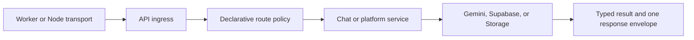

# ADR: Runtime ownership boundaries

- **Status:** Accepted
- **Date:** 2026-08-13

## Context

V-MATE는 Cloudflare Worker와 Node adapter, legacy chat과 room chat, memory와 Supabase 저장소를 함께 지원합니다. 이전 구조에서는 같은 결정을 여러 계층이 반복했습니다.

- transport와 handler가 trace, CORS, body limit, runtime config를 각각 계산
- Gemini raw text를 orchestrator와 caller가 연속으로 해석
- memory와 persistent idempotency가 같은 요청에 다른 응답을 반환
- owner 권한을 dispatcher와 repository가 각각 조회
- route별 lazy facade가 하나의 페이지 구현 module을 공유
- Storage 공개 URL과 asset relation을 모두 삭제 identity로 사용
- fresh schema가 기존 환경의 일회성 rollout 절차까지 포함

한 계층의 fallback이 다른 계층의 오류를 가리는 경우가 있었고, 저장소나 runtime 선택에 따라 같은 요청의 의미가 달라질 수 있었습니다.

## Decision

각 상태와 정책에는 하나의 canonical owner를 둡니다.



### Request boundary

Transport adapter는 bounded body를 읽고 플랫폼별 request/response 형식만 변환합니다. 공통 ingress가 요청마다 다음 값을 한 번 결정합니다.

- trace ID
- origin과 CORS headers
- immutable runtime environment와 parsed config
- body-limit 및 outer error envelope

Worker binding은 request context로 전달하며 API 요청 중 `process.env`를 수정하지 않습니다. Node adapter는 직접 호출 호환을 위해 명시적 environment가 없을 때만 process environment를 사용합니다.

### Chat boundary

Legacy chat과 room chat은 같은 chat-turn service와 model result를 사용합니다.

```ts
type ModelResult =
  | { ok: true; value: AssistantMessage; parseMode: 'strict' | 'recovered' }
  | { ok: false; error: ChatModelError }
```

문법적으로 완결된 loose JSON만 recovered output으로 허용합니다. Plain text, truncated JSON, 필수 field가 없는 output은 `INVALID_MODEL_OUTPUT`으로 실패하고 quota를 환불하며 room turn을 commit하지 않습니다. Retry는 최초 요청과 동일한 conversation, system instruction, generation config를 유지합니다.

Prompt confidentiality guard는 새 model output과 persistent replay 모두 최종 공통 경계에서 검사합니다. 차단할 때는 일부 field만 남기지 않고 assistant payload 전체를 고정된 safe refusal로 교체합니다.

### Route policy and idempotency

Platform route metadata가 method, authentication, owner requirement, mutation/persistence requirement를 선언합니다. Dispatcher는 정책을 한 번 평가하고 검증된 owner capability를 repository에 전달합니다.

Memory와 persistent idempotency는 같은 disposition을 사용합니다.

```text
reserved | replay | in_progress | conflict | limit_exceeded
```

`clientRequestId`가 요청 identity이고 payload fingerprint는 재사용 충돌을 판단합니다. Persistent request는 memory gate를 중복 통과하지 않습니다.

### Frontend state

- 하나의 route table이 URL parse, pathname 생성, render adapter, lazy import를 정의합니다.
- `App`의 navigation blocker가 internal navigation과 Back/Forward를 함께 처리합니다.
- editor는 scope별 draft revision과 mutation revision으로 stale save를 차단합니다.
- keyed resource가 key, abort signal, `idle | loading | success | error` 상태를 소유합니다.
- auth UI와 API bearer resolution은 같은 settled session snapshot과 in-flight request를 공유합니다.
- Detail, Room, Editor, Personal, Ops 구현은 실제 source module과 bundle 경계를 가집니다.

### Assets and schema

Asset relation의 bucket, path, owner, entity, slot, variant가 Storage object의 canonical identity입니다. Relation이 존재하면 공개 URL을 삭제 판단의 fallback으로 사용하지 않습니다. Relation이 전혀 없는 legacy row에만 bounded URL compatibility path를 허용합니다.

DB row 삭제와 Storage 삭제는 outbox, exclusive lease, retry ordering, shared-reference check, account cleanup fence를 유지합니다. 검증할 수 없는 relation은 다른 object를 삭제하는 대신 orphan을 남기는 fail-closed 결과를 선택합니다.

`supabase/schema.sql`은 fresh install의 최종 tables, views, functions, RLS, grants만 표현합니다. 기존 환경의 backup, scrub, conditional restore는 append-only migration history가 소유합니다.

## Consequences

- 동일 요청은 transport나 저장소 구현과 관계없이 같은 public status와 error code를 사용합니다.
- Runtime config와 auth/owner 판단 경로를 request 단위로 추적할 수 있습니다.
- Malformed model output이 정상 대화나 성공 cache entry로 저장되지 않습니다.
- Route 진입이 불필요한 editor, room, ops 구현을 함께 내려받지 않습니다.
- Fresh install과 upgrade는 최종 애플리케이션 권한이 같지만 rollout evidence object의 존재 여부는 다릅니다.

`/api/chat`과 Node adapter는 외부 사용량만으로 제거 여부를 판단할 수 있으므로 compatibility adapter로 유지합니다. 이들은 별도 정책 owner가 아니라 공통 ingress와 service를 사용하는 transport surface입니다.

## Verification

이 결정은 다음 계약으로 검증합니다.

- malformed output, retry parity, prompt confidentiality, quota refund/commit tests
- Worker·Node trace, CORS, body-limit, runtime-environment tests
- route policy와 memory·persistent idempotency conformance tests
- route, dirty navigation, keyed resource, auth session UI tests
- canonical asset deletion, outbox, shared-reference, account-fence tests
- fresh·upgrade DB contracts와 production bundle chunk inspection
