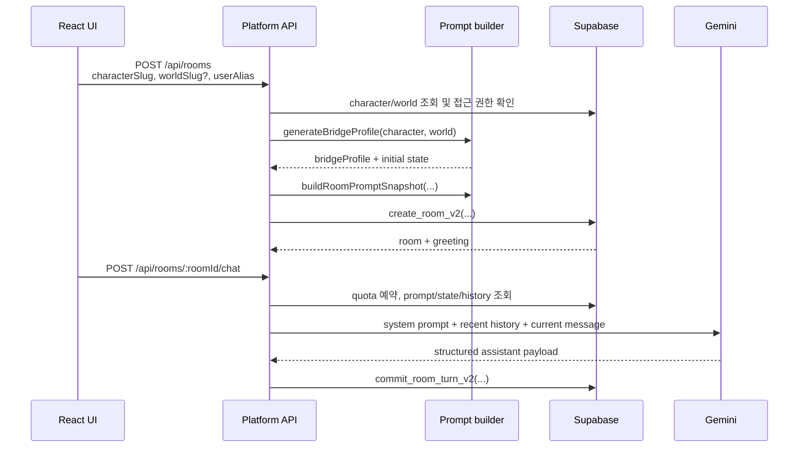

# 채팅 런타임 구조

이 문서는 현재 코드가 캐릭터와 월드를 합성하고 대화 기억을 구성하는 방식을 설명합니다. 제품 아이디어가 아니라 아래 구현을 기준으로 합니다.

- `src/App.tsx`
- `server/platform/api.js`
- `server/platform/prompt-builder.js`
- `server/platform/supabase-platform-repository.js`
- `server/modules/gemini-orchestrator.js`
- `supabase/schema.sql`

## 1. 방 생성부터 첫 대화까지



방 생성 요청에는 캐릭터가 반드시 필요하고 월드는 선택 사항입니다.

```json
{
  "characterSlug": "kael",
  "worldSlug": "rainy-tokyo",
  "userAlias": "나"
}
```

서버는 다음 조건을 확인한 뒤 방을 만듭니다.

1. 요청 사용자가 캐릭터와 월드를 읽을 수 있는가
2. 공개 콘텐츠라면 `visibility = public`, `display_status = visible`인가
3. 콘텐츠가 `hidden`, `quarantined`, `blocked` 상태가 아닌가
4. 캐릭터와 선택한 월드가 실제로 존재하는가

캐릭터-월드 연결 테이블이나 조합 allowlist는 없습니다. 따라서 위 조건을 통과하는 캐릭터와 월드는 임의로 조합됩니다.

## 2. 실제 합성 규칙

합성은 방 생성 시 LLM을 호출하는 방식이 아니라 `generateBridgeProfile()`의 고정 규칙으로 수행됩니다.

### 캐릭터에서 읽는 값

| 값 | 사용처 |
| --- | --- |
| `name`, `headline`, `summary` | 캐릭터 식별과 프롬프트 설명 |
| `promptProfile.persona[]` | 성격 지시 |
| `promptProfile.speechStyle[]` | 말투 지시 |
| `promptProfile.relationshipBaseline` | 방의 시작 관계 |
| `promptProfile.characterIntro` | 월드가 없을 때 시작 장면 |
| `promptProfile.masterPrompt` | 캐릭터 자유 형식 지시 |
| `promptProfile.imageSlots[]` | 모델이 반환할 수 있는 캐릭터 이미지 슬롯 |

### 월드에서 읽는 값

| 값 | 사용처 |
| --- | --- |
| `name`, `headline`, `summary` | 월드 식별과 프롬프트 설명 |
| `promptProfile.rules[]` | 세계 규칙 |
| `promptProfile.tone` / `toneKeywords[]` | 장면 분위기 |
| `promptProfile.genreKey` / `genre` | bridge 역할·목표 템플릿 선택 |
| `promptProfile.worldIntro` | 월드가 있을 때 시작 장면 |
| `promptProfile.starterLocations[]` | 첫 위치 |
| `promptProfile.worldTerms[]` | 초기 world notes |
| `promptProfile.masterPrompt` | 월드 자유 형식 지시 |
| `promptProfile.imageSlots[]` | 모델이 반환할 수 있는 월드 이미지 슬롯 |

### `bridgeProfile` 결정표

| 결과 필드 | 월드 없음 | 월드 있음 |
| --- | --- | --- |
| `entryMode` | `direct_character` | `in_world` |
| `meetingTrigger` | `characterIntro`, 없으면 기본 문장 | `worldIntro`, 없으면 장르별 기본 문장 |
| `relationshipDistance` | 캐릭터의 `relationshipBaseline` | 캐릭터의 `relationshipBaseline` |
| `startingLocation` | `자유 대화 공간` | 첫 `starterLocations`, 없으면 월드 이름 |
| 역할·목표·압력 | 단독 대화 기본값 | `game`, `fantasy`, `city` 템플릿 또는 일반 fallback |

중요한 우선순위는 다음과 같습니다.

- 월드가 없으면 `characterIntro`가 시작 장면을 결정합니다.
- 월드가 있으면 `worldIntro`가 bridge의 시작 장면을 결정합니다. `characterIntro`도 캐릭터 지시에는 남지만 bridge의 `meetingTrigger`로 합쳐지지는 않습니다.
- 관계의 출발점은 월드가 아니라 캐릭터의 `relationshipBaseline`에서 옵니다.
- `genreKey`가 현재 인식하는 특수 템플릿은 `game`, `fantasy`, `city`입니다. 그 외 값은 일반 fallback을 사용합니다.

예를 들어 아래 입력은:

```json
{
  "character": {
    "name": "카엘",
    "relationshipBaseline": "서로 아직 조심스럽다.",
    "characterIntro": "상대를 한 번 살핀 뒤 먼저 말을 건다."
  },
  "world": {
    "name": "비 갠 도쿄",
    "genreKey": "city",
    "worldIntro": "비가 막 그친 편의점 앞에서 장면을 연다.",
    "starterLocations": ["편의점 앞"],
    "worldTerms": ["심야", "젖은 골목"]
  }
}
```

대략 아래 bridge를 만듭니다.

```json
{
  "entryMode": "in_world",
  "characterRoleInWorld": "심야를 함께 걷는 인물",
  "userRoleInWorld": "캐릭터와 같은 장면을 공유하는 상대",
  "meetingTrigger": "비가 막 그친 편의점 앞에서 장면을 연다.",
  "relationshipDistance": "서로 아직 조심스럽다.",
  "startingLocation": "편의점 앞",
  "worldTerms": ["심야", "젖은 골목"]
}
```

## 3. 방에 고정되는 프롬프트

`buildRoomPromptSnapshot()`은 아래 순서로 하나의 문자열을 만듭니다.

1. `PLATFORM CONTRACT`
   - 한국어 응답
   - JSON 출력 계약
   - 이미지 슬롯 선택 규칙
2. `CHARACTER`
   - 이름, 설명, persona, 말투, 관계 기준, intro, master prompt, 이미지 슬롯
3. `WORLD` — 월드가 있을 때만
   - 이름, 설명, rules, tone, 시작 위치, intro, master prompt, 이미지 슬롯
4. `BRIDGE`
   - 캐릭터 역할, 사용자 역할, 첫 장면, 현재 목표, 장면 압력
5. 초기 `ROOM STATE`
   - 상황, 위치, 관계, world notes

이 문자열은 다음 형태로 `rooms.resolved_prompt_snapshot_json`에 저장됩니다.

```json
{
  "basePromptSnapshot": "### PLATFORM CONTRACT\n...",
  "runningSummary": "",
  "compactedUserTurns": 0
}
```

`basePromptSnapshot`은 방 생성 시점의 복사본입니다. 이후 캐릭터나 월드를 수정해도 이미 생성된 방의 기본 프롬프트는 자동으로 바뀌지 않습니다. 이 동작은 기존 대화의 설정이 중간에 변하는 것을 막지만, 콘텐츠 수정 사항을 기존 방에 즉시 반영하지도 않습니다.

## 4. 한 번의 모델 요청에 들어가는 기억

모델 요청은 두 부분으로 나뉩니다.

### system instruction

```text
basePromptSnapshot

### RUNNING SUMMARY
runningSummary

### LIVE ROOM STATE
- Situation: ...
- Location: ...
- Relationship: ...
- Open loops: ...
- World notes: ...
```

### conversation contents

```text
최근 user/assistant 메시지
현재 userMessage
```

저장 위치와 역할은 다음과 같습니다.

| 데이터 | 저장 위치 | 모델 전달 방식 |
| --- | --- | --- |
| 전체 원문 | `room_messages` | 최근 구간만 전달 |
| 기본 설정 | `rooms.resolved_prompt_snapshot_json.basePromptSnapshot` | 매 요청의 system instruction |
| 누적 축약 | 같은 JSON의 `runningSummary` | 있을 때 system instruction에 추가 |
| 축약 기준 턴 | 같은 JSON의 `compactedUserTurns` | 다음 갱신 시점 판단 |
| 현재 상태 | `room_state_summaries` | 매 요청의 live state |
| 조합 결과 | `rooms.bridge_profile_json` | 기본 snapshot 생성과 UI room 데이터 |

전체 메시지를 DB에 보관하는 것과 전체 메시지를 모델에 보내는 것은 다릅니다.

## 5. 현재 압축 알고리즘

`ROOM_MEMORY_CONFIG`의 현재 값은 다음과 같습니다.

```js
{
  summaryRefreshTurns: 10,
  recentRawTurns: 6,
  recentRawMessages: 12,
  maxSummaryChars: 1400
}
```

각 assistant 응답을 저장할 때:

1. greeting을 제외한 메시지를 user/assistant 턴으로 묶습니다.
2. 전체 사용자 턴이 10 이상이고 마지막 압축 기준보다 10턴 이상 늘었는지 확인합니다.
3. 최신 6턴을 제외한 이전 턴을 압축 후보로 잡습니다.
4. 후보 중 마지막 8턴만 짧은 텍스트 줄로 만듭니다.
5. 현재 상황, 위치, 관계, 열린 약속, world notes를 앞에 붙입니다.
6. 결과를 1,400자로 자르고 `runningSummary`를 교체합니다.
7. `compactedUserTurns`를 현재 전체 턴 수로 기록합니다.

여기서 “요약”은 별도 Gemini 호출이나 embedding 검색이 아닙니다. 각 user 문장은 최대 72자, assistant 문장은 최대 96자로 잘라 붙이는 규칙 기반 축약입니다. 이전 `runningSummary`와 새 요약을 의미적으로 병합하지도 않습니다.

### 10턴 시점 예시

10번째 응답을 저장하면:

- 턴 1–4: 요약 후보
- 턴 5–10: 최근 6턴 원문 후보
- `compactedUserTurns`: `10`

20번째 응답을 저장하면 요약을 다시 만들며:

- 턴 1–14가 압축 후보
- 그중 마지막 8개인 턴 7–14만 대화 메모에 남음
- 턴 15–20은 최근 원문 후보

단, 모델 adapter가 적용하는 `GEMINI_HISTORY_MESSAGES`가 최종 상한입니다. 코드 기본값은 12개 메시지지만 현재 `wrangler.jsonc`의 production/staging 값은 10개 메시지입니다. 따라서 Worker에서는 최근 원문 후보 12개 중 마지막 10개만 모델에 전달됩니다. 각 메시지는 기본 700자로 한 번 더 잘립니다.

## 6. live state 갱신 규칙

`updateRoomStateFromMessages()`도 규칙 기반입니다.

| 상태 | 현재 갱신 방식 |
| --- | --- |
| `currentSituation` | assistant `narration`, 없으면 현재 user 메시지 앞 120자 |
| `location` | `narration`에서 첫 `에서` 앞의 짧은 문자열 추출 |
| `relationshipState` | `inner_heart` 또는 `response`에 관계 키워드가 있을 때 해당 문장 사용 |
| `futurePromises` | `다음`, `나중`, `약속`, `다시`, `함께`, `곧`이 포함된 구간 중 최근 4개 |
| `worldNotes` | 위치와 narration 단서 중 최근 6개 |
| `inventory` | 필드는 있으나 현재 자동 갱신하지 않음 |
| `appearance` | 필드는 있으나 현재 자동 갱신하지 않음 |
| `pose` | 필드는 있으나 현재 자동 갱신하지 않음 |

상태 추출은 한국어 키워드와 문자열 규칙에 의존합니다. 모델이 반환한 텍스트의 의미를 별도 분류하거나 검증하지 않습니다.

## 7. 동시성·저장 경계

룸 채팅은 다음 순서로 처리됩니다.

1. `clientRequestId`와 request fingerprint로 일일 quota를 예약합니다.
2. DB 트랜잭션 밖에서 Gemini를 호출합니다.
3. 성공하면 `commit_room_turn_v2`가 예상 room version을 확인하고 user/assistant 메시지, 다음 상태, 다음 prompt snapshot, quota 결과를 함께 반영합니다.
4. 모델 호출이나 prompt/history 조회가 실패하면 quota를 환불합니다.

이 구조는 중복 요청과 오래된 room version의 덮어쓰기를 막기 위한 것입니다. lockdown 이후 쓰기 RPC는 `service_role`만 실행할 수 있고 브라우저는 Worker API를 통해서만 변경합니다.

Gemini 응답은 공통 `ChatTurnService`에서 구조화된 assistant message로 한 번만 해석합니다. 필수 필드가 없는 JSON이나 일반 텍스트는 정상 응답으로 보정하지 않고 `RESPONSE_INVALID_FORMAT`으로 종료하며, room turn을 저장하지 않고 quota를 환불합니다. 네트워크·빈 응답 재시도는 최초 요청과 같은 history, system instruction, generation configuration을 유지합니다. 남은 함수 실행 시간이 부족하면 대화 의미를 축약한 요청으로 바꾸지 않고 retryable error를 반환합니다.

## 8. 현재 보장하지 않는 것

현재 구현을 다음 기능으로 오해하면 안 됩니다.

- LLM이 캐릭터와 월드 설정을 창작해 연결하는 동적 합성
- 모든 과거 대사를 빠짐없이 회상하는 장기 기억
- 인물·사건·소지품별 구조화 fact store
- embedding/vector 기반 관련 기억 검색
- inventory, appearance, pose의 자동 추적
- 콘텐츠 수정 사항의 기존 방 자동 반영

또한 압축 갱신은 10턴 간격인데 최근 원문 창은 계속 앞으로 이동합니다. 두 압축 시점 사이에는 이전 요약 범위와 최신 원문 범위 사이의 대화가 모델 입력에서 빠질 수 있습니다. 긴 `basePromptSnapshot`은 Gemini adapter의 system prompt 문자 상한에 먼저 걸릴 수 있으며, 현재 조립 순서에서는 뒤에 붙는 running summary와 live state가 잘릴 가능성도 있습니다.

장기 기억 품질을 개선하려면 이 두 경계를 먼저 다뤄야 합니다.

1. 요약이 실제로 포함하는 마지막 턴과 raw history 시작점을 연속되게 맞추기
2. base/summary/live state별 문자 예산을 나눠 live state가 항상 남도록 조립하기

## 9. 변경할 때 볼 테스트

```bash
node --test server/platform/prompt-builder.test.js
node --test server/platform/supabase-platform-repository.test.js
node --test server/platform/api.test.js
node --test server/modules/gemini-orchestrator.test.js
```

전체 계약은 `npm run verify`로 확인합니다.
