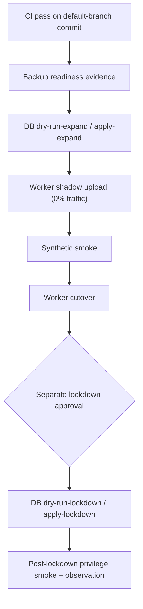

# 운영·설정

이 문서는 로컬 구성과 승인된 운영 절차를 모읍니다. 원격 DB 변경, secret 변경, Worker 배포는 저장소 명령을 임의로 실행하지 않고 승인된 GitHub Environment와 `workflow_dispatch`를 사용합니다.

## 1. 환경 변수

실제 값은 저장소에 커밋하지 않습니다. 브라우저에 노출 가능한 값과 서버 전용 secret을 분리합니다.

### 브라우저 공개 구성

| 변수 | 설명 |
| --- | --- |
| `VITE_SUPABASE_URL` | Supabase 프로젝트 URL |
| `VITE_SUPABASE_ANON_KEY` 또는 `VITE_SUPABASE_PUBLISHABLE_KEY` | 브라우저 공개 키 |
| `VITE_CHAT_API_BASE_URL` | 프론트엔드와 API가 다른 출처일 때의 API 기준 URL |

브라우저는 same-origin `/api`를 우선합니다. 교차 출처 값이 브라우저의 현재 origin과 다르면 프론트엔드는 안전하게 `/api`로 fallback합니다.

### 서버 전용 값

| 변수 | 설명 |
| --- | --- |
| `GOOGLE_API_KEY` | Gemini 채팅 호출 |
| `SUPABASE_SERVICE_ROLE_KEY` | 서버 전용 DB RPC, 콘텐츠 변경, 계정/Storage 정리 |
| `SUPABASE_URL` | 서버가 사용할 Supabase URL. 없으면 공개 URL 계열을 순서대로 확인 |
| `SUPABASE_ANON_KEY` 또는 `SUPABASE_PUBLISHABLE_KEY` | 공개/사용자 RLS client 생성 |

`SUPABASE_SERVICE_ROLE_KEY`는 브라우저 번들, 로그, 예제 payload에 넣지 않습니다.

### 네트워크·인증 guardrail

| 변수 | 기본 방향 |
| --- | --- |
| `ALLOWED_ORIGINS` | 허용할 browser origin 목록 |
| `ALLOW_ALL_ORIGINS` | 기본 `false` |
| `ALLOW_NON_BROWSER_ORIGIN` | 기본 `false` |
| `REQUIRE_AUTH_FOR_CHAT` | 기본 `true` |
| `REQUIRE_CONFIGURED_SUPABASE_URL` | 운영에서 `true` |
| `AUTH_PROVIDER_TIMEOUT_MS` | 기본 `3500` |
| `AUTH_PROVIDER_RETRY_COUNT` | 기본 `1` |
| `CLIENT_REQUEST_DEDUPE_WINDOW_MS` | 기본 `15000` |
| `CLIENT_REQUEST_DEDUPE_MAX_ENTRIES` | 기본 `2000` |
| `CHAT_DAILY_MESSAGE_LIMIT` | 한국 시간 기준 기본 30 |

운영 Origin은 Cloudflare dashboard vars에서 관리합니다. 교차 출처 배포를 의도한 경우 `VITE_CHAT_API_BASE_URL`과 `ALLOWED_ORIGINS`를 함께 검토합니다.

### runtime store

| 변수 | 설명 |
| --- | --- |
| `RATE_LIMIT_STORE` | `memory` 또는 `kv` |
| `PROMPT_CACHE_STORE` | `memory` 또는 `kv` |
| `V_MATE_RATE_LIMIT_KV` | Cloudflare KV rate-limit binding |
| `V_MATE_PROMPT_CACHE_KV` | Cloudflare KV prompt-cache binding |

`wrangler.jsonc`의 기본 store mode는 `memory`입니다. `kv`를 선택했는데 대응 binding이 없으면 해당 runtime adapter를 사용할 수 없습니다. binding 이름은 앞뒤 공백 없이 정확히 일치시킵니다.

## 2. 로컬 실행 모드

### Vite + Cloud Run adapter

PowerShell A:

```powershell
$env:PORT=8788
npm start
```

PowerShell B:

```powershell
npm run dev
```

Vite가 `/api`를 `127.0.0.1:8788`로 proxy합니다. Supabase가 구성되지 않은 비운영 로컬 환경은 in-memory platform store로 fallback할 수 있지만, 실제 Gemini 응답에는 `GOOGLE_API_KEY`가 필요합니다.

### Worker 통합 실행

```bash
npm run cf:dev
```

이 명령은 먼저 프론트엔드를 빌드한 뒤 Wrangler dev server에서 정적 자산과 API를 함께 제공합니다. Wrangler용 로컬 secret은 gitignored `.dev.vars`에 두고 실제 값을 커밋하지 않습니다.

## 3. 데이터베이스

SQL 파일별 적용 대상, immutable migration 규칙, fresh/upgrade test 경로는 [`supabase/README.md`](../supabase/README.md)를 기준으로 합니다.

운영 release의 핵심 경계는 다음과 같습니다.

1. expand migration 적용
2. v2 Worker shadow/smoke/cutover 검증
3. 별도 lockdown 승인과 적용
4. post-lockdown privilege 검증

lockdown 이후에는 직접 browser write 권한을 복구하지 않고 v2-compatible Worker 복원 또는 forward migration을 사용합니다.

## 4. owner 설정

운영실은 owner 계정만 접근할 수 있습니다. `profiles.is_owner`나 공개 `app_settings`를 owner 권한의 source of truth로 사용하지 않습니다.

승인된 Supabase 관리자 세션에서만 비공개 테이블을 변경합니다.

```sql
insert into public.owner_users (user_id)
values ('YOUR_AUTH_USER_ID')
on conflict (user_id) do nothing;
```

starter 콘텐츠는 권리가 확인된 운영 절차로 관리합니다.

## 5. release 순서

`main` push와 pull request의 CI는 읽기 전용 검증만 수행합니다. 원격 write는 승인된 수동 workflow에서만 일어납니다.



주요 workflow:

| workflow | 역할 |
| --- | --- |
| `release-backup-readiness.yml` | expand 전 backup/PITR readiness evidence |
| `release-database.yml` | 선택한 expand 또는 lockdown 한 단계만 dry-run/apply |
| `release-worker.yml` | Worker shadow, smoke, cutover, evidence-bound rollback |
| `release-staging-synthetic-smoke.yml` | staging v2 A/B 시나리오 검증 |
| `release-post-lockdown-privilege-smoke.yml` | SQL role과 실제 HTTP 쓰기 경계 검증 |
| `release-post-lockdown-observation.yml` | lockdown 이후 관찰 evidence |
| `release-database-baseline-attestation.yml` | 제한된 production read-only baseline 경로 |

Worker release는 확장 migration evidence가 기본입니다. DB/schema/data 변경이 없는 allowlisted domain/canonical 변경만 별도 승인된 read-only baseline attestation을 사용할 수 있습니다. 이 경로는 `db push`나 원격 DML을 실행하지 않으며 `AUTHORIZED_DOMAIN_RELEASE_SHA`가 현재 40자리 release commit SHA와 일치해야 합니다.

승인 환경이 보관하는 배포 자격 증명:

- `CLOUDFLARE_API_TOKEN`
- `CLOUDFLARE_OBSERVABILITY_TOKEN`
- `CLOUDFLARE_ACCOUNT_ID`
- `SUPABASE_ACCESS_TOKEN`

런타임 공개 구성:

- `VITE_SUPABASE_URL`
- `VITE_SUPABASE_ANON_KEY` 또는 `VITE_SUPABASE_PUBLISHABLE_KEY`
- `VITE_CHAT_API_BASE_URL`

`wrangler versions deploy`는 승인된 `release-worker.yml` 안에서만 사용합니다.

## 6. rollback

수동 rollback은 성공한 release evidence와 DB 단계에 결속됩니다.

- **pre-lockdown**: 승인된 이전 v2 Worker version으로 복원
- **post-lockdown**: lockdown evidence와 호환되는 v2 Worker version으로 복원
- **DB 계약 변경 필요**: 권한을 후퇴시키는 down migration 대신 새 forward migration 작성

lockdown 후 `anon`/`authenticated`의 직접 table/Storage 쓰기 권한을 복구 수단으로 되살리지 않습니다.

## 7. 검증

일반 변경의 기본 검증:

```bash
npm run validate:surfaces
npm run typecheck
npm test
npm run build
```

전체 저장소 계약:

```bash
npm run verify
```

추가 release 검증:

```bash
npm run test:server:coverage
npm run test:contracts:coverage
npm audit --audit-level=high
npm run cf:dry-run
```

`npm run cf:dry-run`은 로컬 build/upload 계약 확인용입니다. 실제 deploy나 원격 DB write를 대신하지 않습니다.
