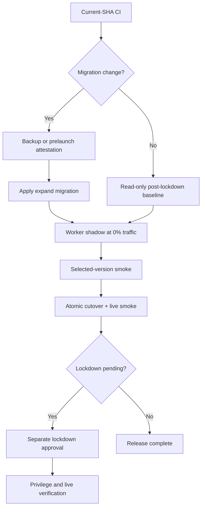

# 운영·설정

원격 DB 변경, secret 변경, Worker 배포는 승인된 GitHub Environment와 `workflow_dispatch`에서만 수행합니다. 저장소의 로컬 명령은 개발과 검증에 사용합니다.

## 1. 환경 변수

실제 값은 저장소에 커밋하지 않습니다. 브라우저에 노출 가능한 값과 서버 전용 secret을 분리합니다.

### 브라우저 공개 구성

| 변수 | 설명 |
| --- | --- |
| `VITE_SUPABASE_URL` | Supabase 프로젝트 URL |
| `VITE_SUPABASE_ANON_KEY` 또는 `VITE_SUPABASE_PUBLISHABLE_KEY` | 브라우저 공개 키 |
| `VITE_CHAT_API_BASE_URL` | 프론트엔드와 API가 다른 출처일 때의 API 기준 URL |

브라우저는 same-origin `/api`를 우선합니다. 교차 출처 값이 현재 origin과 다르면 프론트엔드는 `/api`를 사용합니다.

### 서버 전용 값

| 변수 | 설명 |
| --- | --- |
| `GOOGLE_API_KEY` | Gemini 채팅 호출 |
| `SUPABASE_SERVICE_ROLE_KEY` | 서버 전용 DB RPC, 콘텐츠 변경, 계정·Storage 정리 |
| `SUPABASE_URL` | 서버가 사용할 Supabase URL. 없으면 공개 URL 계열을 순서대로 확인 |
| `SUPABASE_ANON_KEY` 또는 `SUPABASE_PUBLISHABLE_KEY` | 공개·사용자 RLS client 생성 |

`SUPABASE_SERVICE_ROLE_KEY`는 브라우저 번들, 로그, 예제 payload에 넣지 않습니다.

### 네트워크·인증

| 변수 | 기본 방향 |
| --- | --- |
| `ALLOWED_ORIGINS` | 허용할 브라우저 origin 목록 |
| `ALLOW_ALL_ORIGINS` | 기본 `false` |
| `ALLOW_NON_BROWSER_ORIGIN` | 기본 `false` |
| `REQUIRE_AUTH_FOR_CHAT` | 기본 `true` |
| `REQUIRE_CONFIGURED_SUPABASE_URL` | 운영에서 `true` |
| `AUTH_PROVIDER_TIMEOUT_MS` | 기본 `3500` |
| `AUTH_PROVIDER_RETRY_COUNT` | 기본 `1` |
| `CLIENT_REQUEST_DEDUPE_WINDOW_MS` | 기본 `15000` |
| `CLIENT_REQUEST_DEDUPE_MAX_ENTRIES` | 기본 `2000` |
| `CHAT_DAILY_MESSAGE_LIMIT` | 한국 시간 기준 기본 `30` |

운영 origin은 Cloudflare dashboard vars에서 관리합니다. 교차 출처 배포에서는 `VITE_CHAT_API_BASE_URL`과 `ALLOWED_ORIGINS`를 함께 변경합니다.

### 런타임 저장소

| 변수 | 설명 |
| --- | --- |
| `RATE_LIMIT_STORE` | `memory` 또는 `kv` |
| `PROMPT_CACHE_STORE` | `memory` 또는 `kv` |
| `V_MATE_RATE_LIMIT_KV` | Cloudflare KV rate-limit binding |
| `V_MATE_PROMPT_CACHE_KV` | Cloudflare KV prompt-cache binding |

`wrangler.jsonc`의 기본 저장소는 `memory`입니다. `kv`를 선택하면 대응 binding이 필요하며, binding 이름은 앞뒤 공백 없이 정확히 일치해야 합니다.

## 2. 로컬 실행

### Vite + Node API adapter

터미널 A:

```bash
npm start
```

터미널 B:

```bash
npm run dev
```

Node adapter는 기본적으로 `http://127.0.0.1:8080`에서 실행되고 Vite는 `/api`를 그 주소로 전달합니다. Cloud Run에서는 플랫폼이 주입하는 `PORT`를 사용합니다. Supabase가 없는 비운영 로컬 환경은 in-memory platform store를 사용할 수 있지만 실제 Gemini 응답에는 `GOOGLE_API_KEY`가 필요합니다.

### Worker 통합 실행

```bash
npm run cf:dev
```

이 명령은 프론트엔드를 빌드한 뒤 Wrangler dev server에서 정적 자산과 API를 함께 제공합니다. Wrangler용 로컬 secret은 gitignored `.dev.vars`에 둡니다.

## 3. 데이터베이스

SQL 파일별 대상, immutable migration 규칙, fresh/upgrade test 경로는 [`supabase/README.md`](../supabase/README.md)를 기준으로 합니다.

- 기존 환경의 변경은 새 append-only migration으로 작성합니다.
- `schema.sql`은 신규 환경의 최종 상태를 표현하며 과거 rollout 절차를 재생하지 않습니다.
- DB 계약을 바꾸면 fresh와 upgrade 경로를 모두 검증합니다.
- lockdown 이후에는 브라우저 직접 쓰기 권한을 복구하지 않고 호환 Worker 또는 새 forward migration을 사용합니다.

## 4. owner 설정

운영실 권한은 비공개 `owner_users`가 소유합니다. `profiles.is_owner`나 공개 `app_settings`를 권한 판단에 사용하지 않습니다.

승인된 Supabase 관리자 세션에서만 owner를 추가합니다.

```sql
insert into public.owner_users (user_id)
values ('YOUR_AUTH_USER_ID')
on conflict (user_id) do nothing;
```

starter 콘텐츠는 권리를 확인한 운영자가 게시합니다.

## 5. release

`main` push와 pull request의 CI는 읽기 전용입니다. 원격 write는 승인된 수동 workflow에서만 수행합니다.



### 승인된 workflow

| workflow | 역할 |
| --- | --- |
| [`release-backup-readiness.yml`](../.github/workflows/release-backup-readiness.yml) | expand·lockdown 전 backup/PITR readiness |
| [`release-database.yml`](../.github/workflows/release-database.yml) | 선택한 expand 또는 lockdown 한 단계의 dry-run/apply |
| [`release-prelaunch-attestation.yml`](../.github/workflows/release-prelaunch-attestation.yml) | staging을 사용할 수 없는 최초 전환의 읽기 전용 production attestation |
| [`release-worker.yml`](../.github/workflows/release-worker.yml) | Worker shadow, smoke, cutover, evidence-bound rollback |
| [`release-staging-synthetic-smoke.yml`](../.github/workflows/release-staging-synthetic-smoke.yml) | staging의 인증·콘텐츠·룸·Storage 시나리오 검증 |
| [`release-post-lockdown-privilege-smoke.yml`](../.github/workflows/release-post-lockdown-privilege-smoke.yml) | SQL role과 실제 HTTP 쓰기 경계 검증 |
| [`release-post-lockdown-observation.yml`](../.github/workflows/release-post-lockdown-observation.yml) | lockdown 직후 serving version과 공개 origin 검증 |
| [`release-database-baseline-attestation.yml`](../.github/workflows/release-database-baseline-attestation.yml) | post-lockdown non-migration release의 read-only DB 기준선 |

모든 release evidence는 target, project, release track, commit과 일치해야 합니다. DB와 Worker workflow의 `release_track`/`database_release_track`은 같은 값을 사용하며 `backend-stabilization`과 `prompt-privacy` evidence를 서로 대체하지 않습니다.

### Migration을 포함한 release

1. 데이터 보존이 필요한 expand·lockdown 전에 승인된 backup/PITR evidence를 확인합니다.
2. expand migration을 적용하고 동일 commit의 Worker를 0% traffic shadow로 올립니다.
3. selected-version smoke가 성공한 version만 cutover합니다.
4. lockdown은 별도 승인을 받아 한 단계로 적용합니다.
5. 적용된 lockdown evidence를 이어받아 privilege smoke와 공개 origin 검증을 수행합니다.

Prelaunch direct 경로는 보존할 production 사용자 데이터가 없고 staging 검증을 사용할 수 없는 최초 전환에만 허용됩니다. `production-db-preflight` 승인과 `PRELAUNCH_DIRECT_APPROVED`가 필요하며, attestation은 원격 write 없이 catalog와 보호 데이터 fingerprint를 확인합니다. Artifact에는 실제 사용자 데이터나 row count 대신 keyed HMAC만 기록합니다. Apply 직전 원격 상태가 attestation과 다르면 write 전에 중단합니다.

### Migration이 없는 post-lockdown release

Runtime, frontend, fresh-schema snapshot만 바뀐 release는 다음 조건에서 read-only baseline을 사용할 수 있습니다.

- trusted lockdown source부터 현재 SHA까지 `supabase/migrations/**`가 변경되지 않음
- 현재 SHA가 보호 환경에서 승인됐고 동일 SHA의 CI quality와 로컬 DB 계약 job이 성공함
- 원격 migration fingerprint와 prompt read 권한 검사가 통과함
- 동일 SHA의 disposable fresh/upgrade DB 계약이 모두 통과하고 두 카탈로그 fingerprint가 canonical 형식임
- 이전 baseline이 schema 4라면 운영 `public`·`vmate_private` 카탈로그 fingerprint가 이전 값과 정확히 일치함
- baseline evidence가 생성 후 6시간 이내임

Fresh DB는 별도 계약 검증과 fingerprint 생성을 수행하지만, upgrade 전용 복구 테이블과 immutable manifest를 의도적으로 만들지 않으므로 운영 fingerprint의 비교 대상은 아닙니다. Schema 3 이전 baseline에는 앱 카탈로그 fingerprint가 없으므로, migration fingerprint와 기존 권한·뷰 불변식이 모두 통과한 첫 schema 4 baseline이 현재 값을 확립합니다. 이후 schema 4 갱신은 그 값의 연속성을 엄격히 확인합니다. Supabase가 관리하는 `auth`·`storage` 카탈로그의 변화는 앱 소유 카탈로그와 migration 검증이 모두 통과한 뒤 관찰값으로만 기록합니다. 만료된 baseline은 유효한 이전 baseline lineage를 검증한 뒤 원격 fingerprint를 다시 읽어 갱신합니다. 그 사이 serving Worker가 바뀌었다면 성공한 cutover evidence도 함께 검증합니다. 이전 lineage나 필요한 cutover artifact를 확인할 수 없으면 중단합니다. 이 경로는 migration을 다시 실행하거나 원격 DB를 수정하지 않습니다.

### 배포 자격 증명

승인 환경만 다음 값을 보관합니다.

- `CLOUDFLARE_API_TOKEN`
- `CLOUDFLARE_OBSERVABILITY_TOKEN`
- `CLOUDFLARE_ACCOUNT_ID`
- `SUPABASE_ACCESS_TOKEN`

런타임 공개 구성은 `VITE_SUPABASE_URL`, `VITE_SUPABASE_ANON_KEY` 또는 `VITE_SUPABASE_PUBLISHABLE_KEY`, `VITE_CHAT_API_BASE_URL`입니다. `wrangler versions deploy`는 `release-worker.yml` 안에서만 사용합니다.

## 6. rollback

Worker cutover가 검증 단계에서 실패하면 workflow가 release evidence의 이전 안정 version을 복원하고 공개 origin smoke를 실행합니다. 수동 rollback도 성공한 release artifact가 지정한 `previousStableVersionId`만 대상으로 합니다.

- **pre-lockdown**: 해당 release track의 lockdown 전 계약과 호환되는 Worker로 복원
- **post-lockdown**: lockdown 후 권한과 호환되는 Worker로 복원
- **DB 계약 변경**: down migration이나 grant 복원 대신 새 forward migration 작성

`prompt-privacy` lockdown은 scrub 전에 owner 전용 logical backup과 immutable manifest를 만듭니다. 복구가 필요하면 [lockdown migration](../supabase/migrations/20260729010000_private_prompt_reads_lockdown.sql)의 conditional forward-restore 절차를 사용하고 manifest와 room-version fence를 먼저 확인합니다. 이 logical backup은 physical backup을 대체하지 않으며 fresh `schema.sql`에는 생성되지 않습니다.

lockdown 후 `anon`/`authenticated`의 직접 table·Storage 쓰기 권한을 rollback 수단으로 되살리지 않습니다.

## 7. 검증

일반 변경:

```bash
npm run validate:surfaces
npm run typecheck
npm test
npm run build
```

전체 로컬 계약:

```bash
npm run verify
```

DB 또는 release 변경 시 추가 검증:

```bash
npm run test:db
npm run test:server:coverage
npm audit --audit-level=high
npm run cf:dry-run
```

`npm run cf:dry-run`은 build/upload 계약만 확인하며 실제 deploy나 원격 DB write를 수행하지 않습니다.
