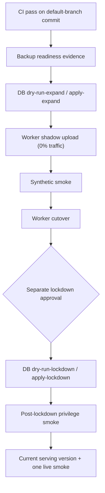

# 운영·설정

이 문서는 로컬 구성과 승인된 운영 절차를 모읍니다. 원격 DB 변경, secret 변경, Worker 배포는 저장소 명령을 임의로 실행하지 않고 승인된 GitHub Environment와 `workflow_dispatch`를 사용합니다.

## 1. 환경 변수

실제 값은 저장소에 커밋하지 않습니다. 브라우저에 노출 가능한 값과 서버 전용 secret을 분리합니다.

### 브라우저 공개 구성

| 변수 | 설명 |
| --- | --- |
| `VITE_SUPABASE_URL` | Supabase 프로젝트 URL |
| `VITE_SUPABASE_ANON_KEY` 또는 `VITE_SUPABASE_PUBLISHABLE_KEY` | 브라우저 공개 키 |
| `VITE_CHAT_API_BASE_URL` | 프론트엔드와 API가 다른 출처일 때의 API 기준 URL |

브라우저는 same-origin `/api`를 우선합니다. 교차 출처 값이 브라우저의 현재 origin과 다르면 프론트엔드는 안전하게 `/api`로 fallback합니다.

### 서버 전용 값

| 변수 | 설명 |
| --- | --- |
| `GOOGLE_API_KEY` | Gemini 채팅 호출 |
| `SUPABASE_SERVICE_ROLE_KEY` | 서버 전용 DB RPC, 콘텐츠 변경, 계정/Storage 정리 |
| `SUPABASE_URL` | 서버가 사용할 Supabase URL. 없으면 공개 URL 계열을 순서대로 확인 |
| `SUPABASE_ANON_KEY` 또는 `SUPABASE_PUBLISHABLE_KEY` | 공개/사용자 RLS client 생성 |

`SUPABASE_SERVICE_ROLE_KEY`는 브라우저 번들, 로그, 예제 payload에 넣지 않습니다.

### 네트워크·인증 guardrail

| 변수 | 기본 방향 |
| --- | --- |
| `ALLOWED_ORIGINS` | 허용할 browser origin 목록 |
| `ALLOW_ALL_ORIGINS` | 기본 `false` |
| `ALLOW_NON_BROWSER_ORIGIN` | 기본 `false` |
| `REQUIRE_AUTH_FOR_CHAT` | 기본 `true` |
| `REQUIRE_CONFIGURED_SUPABASE_URL` | 운영에서 `true` |
| `AUTH_PROVIDER_TIMEOUT_MS` | 기본 `3500` |
| `AUTH_PROVIDER_RETRY_COUNT` | 기본 `1` |
| `CLIENT_REQUEST_DEDUPE_WINDOW_MS` | 기본 `15000` |
| `CLIENT_REQUEST_DEDUPE_MAX_ENTRIES` | 기본 `2000` |
| `CHAT_DAILY_MESSAGE_LIMIT` | 한국 시간 기준 기본 30 |

운영 Origin은 Cloudflare dashboard vars에서 관리합니다. 교차 출처 배포를 의도한 경우 `VITE_CHAT_API_BASE_URL`과 `ALLOWED_ORIGINS`를 함께 검토합니다.

### runtime store

| 변수 | 설명 |
| --- | --- |
| `RATE_LIMIT_STORE` | `memory` 또는 `kv` |
| `PROMPT_CACHE_STORE` | `memory` 또는 `kv` |
| `V_MATE_RATE_LIMIT_KV` | Cloudflare KV rate-limit binding |
| `V_MATE_PROMPT_CACHE_KV` | Cloudflare KV prompt-cache binding |

`wrangler.jsonc`의 기본 store mode는 `memory`입니다. `kv`를 선택했는데 대응 binding이 없으면 해당 runtime adapter를 사용할 수 없습니다. binding 이름은 앞뒤 공백 없이 정확히 일치시킵니다.

## 2. 로컬 실행 모드

### Vite + Cloud Run adapter

PowerShell A:

```powershell
$env:PORT=8788
npm start
```

PowerShell B:

```powershell
npm run dev
```

Vite가 `/api`를 `127.0.0.1:8788`로 proxy합니다. Supabase가 구성되지 않은 비운영 로컬 환경은 in-memory platform store로 fallback할 수 있지만, 실제 Gemini 응답에는 `GOOGLE_API_KEY`가 필요합니다.

### Worker 통합 실행

```bash
npm run cf:dev
```

이 명령은 먼저 프론트엔드를 빌드한 뒤 Wrangler dev server에서 정적 자산과 API를 함께 제공합니다. Wrangler용 로컬 secret은 gitignored `.dev.vars`에 두고 실제 값을 커밋하지 않습니다.

## 3. 데이터베이스

SQL 파일별 적용 대상, immutable migration 규칙, fresh/upgrade test 경로는 [`supabase/README.md`](../supabase/README.md)를 기준으로 합니다.

운영 release의 핵심 경계는 다음과 같습니다.

1. expand migration 적용
2. v2 Worker shadow/smoke/cutover 검증
3. 별도 lockdown 승인과 적용
4. post-lockdown privilege 검증
5. 현재 serving version과 공개 origin을 즉시 1회 검증

lockdown 이후에는 직접 browser write 권한을 복구하지 않고 v2-compatible Worker 복원 또는 forward migration을 사용합니다.

## 4. owner 설정

운영실은 owner 계정만 접근할 수 있습니다. `profiles.is_owner`나 공개 `app_settings`를 owner 권한의 source of truth로 사용하지 않습니다.

승인된 Supabase 관리자 세션에서만 비공개 테이블을 변경합니다.

```sql
insert into public.owner_users (user_id)
values ('YOUR_AUTH_USER_ID')
on conflict (user_id) do nothing;
```

starter 콘텐츠는 권리가 확인된 운영 절차로 관리합니다.

## 5. release 순서

`main` push와 pull request의 CI는 읽기 전용 검증만 수행합니다. 원격 write는 승인된 수동 workflow에서만 일어납니다.



주요 workflow:

| workflow | 역할 |
| --- | --- |
| `release-backup-readiness.yml` | expand와 `prompt-privacy` lockdown 전 backup/PITR readiness evidence |
| `release-database.yml` | 선택한 expand 또는 lockdown 한 단계만 dry-run/apply |
| `release-prelaunch-attestation.yml` | staging이 없는 출시 전 production의 읽기 전용 catalog·row-count·보호 데이터 HMAC 증명 |
| `release-worker.yml` | Worker shadow, smoke, cutover, evidence-bound rollback |
| `release-staging-synthetic-smoke.yml` | staging v2 A/B 시나리오 검증 |
| `release-post-lockdown-privilege-smoke.yml` | SQL role과 실제 HTTP 쓰기 경계 검증 |
| `release-post-lockdown-observation.yml` | lockdown 직후 현재 serving version과 공개 origin을 1회 검증 |
| `release-database-baseline-attestation.yml` | post-lockdown production의 non-migration 변경을 위한 read-only baseline 증명 |

Worker release는 확장 migration evidence가 기본입니다. `prompt-privacy` lockdown 이후 append-only migration을 추가·삭제·rename·수정하지 않는 runtime·frontend·fresh-schema snapshot 변경은 별도 승인된 read-only baseline을 사용할 수 있습니다. Baseline workflow와 Worker workflow는 모두 trusted lockdown source부터 현재 release SHA까지 `supabase/migrations/**`가 동일한지 fail-closed로 확인하므로 이 경로에서 이미 적용된 migration을 다시 실행하지 않습니다. 현재 default-branch SHA는 보호 환경의 `AUTHORIZED_BASELINE_RELEASE_SHA`와 정확히 일치해야 하고, 같은 SHA의 CI `quality`와 `Database contracts (local Docker only)`가 성공해야 합니다. 이 경로는 배포된 `084b38123a37e70d3fa51093fe44b39098a36bc2` Worker, lockdown run `30475814012`, privilege run `30479630582`, live verification run `30479760383`의 연결을 검증하고 현재 migration/release fingerprints와 prompt read 권한을 다시 읽습니다. 원본 lockdown artifact가 만료된 경우에는 아직 유효한 직전 성공 baseline run을 `previous_baseline_evidence_run_id`로 지정해 증거를 갱신할 수 있습니다. 그 baseline 이후 정상 cutover로 서빙 Worker가 바뀌었다면 해당 성공 run을 `serving_cutover_evidence_run_id`에도 지정합니다. 이 두 번째 증거는 GitHub workflow/run, default-branch commit ancestry, project fingerprint, 이전 baseline ID와 서빙 버전, immutable shadow metadata, cutover smoke 결과를 모두 만족해야만 새 서빙 버전을 기준선으로 승격합니다. Renewal 경로는 이전 run의 원본 lineage ID·fingerprint·불변식과 migration 무변경을 다시 검증하고, 원격 fingerprint를 다시 읽어 이전 값과 비교합니다. 재조회는 read-only로만 수행합니다. 생성되는 schema v3 evidence는 이전 baseline과 serving cutover run ID를 함께 기록합니다. 유효한 이전 baseline artifact도 없으면 fail-closed로 중단합니다. 필요한 cutover artifact가 없을 때도 동일하며, migration workflow를 재실행하거나 현재 원격 값을 새 기준으로 임의 채택하지 않습니다. Baseline evidence는 생성 후 6시간 동안만 shadow/smoke/cutover에 사용할 수 있습니다. `db push`, 원격 DML, 장시간 관찰은 실행하지 않습니다. `production-db-baseline-attestation`, `production-shadow`, `production-smoke`, `production-cutover`의 `AUTHORIZED_BASELINE_RELEASE_SHA`는 현재 40자리 release commit SHA와 일치해야 합니다.

DB와 Worker workflow의 `release_track`/`database_release_track`은 같은 값을 사용합니다. `backend-stabilization`과 `prompt-privacy` evidence는 서로 대체할 수 없으며, post-lockdown privilege smoke와 즉시 검증은 version과 release track을 수동 입력받지 않고 적용된 lockdown evidence에서 이어받습니다.

Prelaunch direct 경로는 production에 보존 대상 사용자 데이터가 없고 별도 staging 검증이 불가능한 최초 `prompt-privacy` 전환에서만 사용할 수 있습니다. `production-db-preflight` 승인 환경에서 `release-prelaunch-attestation.yml`에 `PRELAUNCH_DIRECT_APPROVED`를 입력하면 원격 write 없이 production project guard와 동일 default-branch commit의 CI를 확인합니다. 읽기 전용 SQL은 catalog, `auth.users`와 `storage.objects`를 포함한 row count, 계정·prompt·방 상태/version·첫 인사·Storage key/metadata의 ordered fingerprint를 계산합니다. Artifact에는 실제 count나 사용자·prompt·Storage 데이터 대신 `SUPABASE_ACCESS_TOKEN`으로 keyed HMAC만 기록합니다.

`production:prompt-privacy:apply-expand`는 staging post-lockdown privilege evidence와 6시간 이내 prelaunch evidence 중 정확히 하나만 받습니다. Prelaunch expand는 additive migration이므로 이 경로에서만 physical backup/PITR evidence를 생략할 수 있습니다. Apply 직전 같은 네 가지 읽기 전용 query를 다시 실행하며 current catalog·row-count·보호 데이터 HMAC이 attestation과 다르면 write 전에 중단합니다. Worker workflow는 받은 expand run이 성공한 동일 SHA·default-branch의 `release-database.yml` dispatch인지 확인합니다.

Worker shadow/smoke/cutover 동안 최초 attestation의 6시간 기한이 지나면 `apply-lockdown` 전에 attestation을 갱신합니다. 갱신 run은 같은 SHA·project·track이어야 하며, original expand evidence와 keyed row-count·보호 데이터 HMAC이 같아야 합니다. Catalog HMAC은 expand 전후에 달라질 수 있으므로 original과 renewal 사이에서 비교하지 않고 각 attestation과 그 직후 current DB 사이에서만 비교합니다. Database artifact는 original과 renewal run ID 및 keyed hashes를 별도 필드로 보존합니다. 다른 target, track, operation과 staging 기반 production 전환은 기존 backup/PITR 및 staging evidence gate를 그대로 사용합니다.

Prelaunch direct의 최종 post-lockdown gate는 24시간을 기다리지 않습니다. `apply-lockdown` evidence는 6시간 이내, privilege smoke evidence는 30분 이내여야 합니다. 해당 Worker version이 유일하게 100% traffic을 제공하는지 확인한 뒤 version override 없이 공개 origin에 live smoke를 한 번 실행합니다.

승인 환경이 보관하는 배포 자격 증명:

- `CLOUDFLARE_API_TOKEN`
- `CLOUDFLARE_OBSERVABILITY_TOKEN`
- `CLOUDFLARE_ACCOUNT_ID`
- `SUPABASE_ACCESS_TOKEN`

런타임 공개 구성:

- `VITE_SUPABASE_URL`
- `VITE_SUPABASE_ANON_KEY` 또는 `VITE_SUPABASE_PUBLISHABLE_KEY`
- `VITE_CHAT_API_BASE_URL`

`wrangler versions deploy`는 승인된 `release-worker.yml` 안에서만 사용합니다.

## 6. rollback

수동 rollback은 성공한 release evidence와 DB 단계에 결속됩니다.

- **pre-lockdown**: 승인된 이전 v2 Worker version으로 복원
- **post-lockdown**: lockdown evidence와 호환되는 v2 Worker version으로 복원
- **DB 계약 변경 필요**: 권한을 후퇴시키는 down migration 대신 새 forward migration 작성

`pre-lockdown`과 `post-lockdown`은 선택한 release track을 기준으로 판정합니다. `prompt-privacy`의 pre-lockdown은 backend 쓰기 권한이 이미 회수되고 safe view가 설치됐지만 raw prompt read가 아직 유지된 상태이며, post-lockdown은 raw prompt read까지 회수된 상태입니다.

`prompt-privacy` lockdown은 과거 방의 초기 상황·위치·관계·월드 용어 캐시와 첫 assistant 인사 메시지도 안전한 기본값으로 교체합니다. 일반 경로의 `prompt-privacy:apply-lockdown`은 적용 시점부터 6시간 이내에 생성된 동일 commit·target·project의 승인된 physical backup evidence를 필수로 검증합니다. Prelaunch direct 경로만 같은 6시간 제한의 attestation으로 이 gate를 대체합니다. Migration은 scrub 전에 `vmate_private.prompt_lockdown_room_state_backup_20260729`와 `vmate_private.prompt_lockdown_greeting_backup_20260729`를 만들고, `vmate_private.prompt_lockdown_backup_manifest_20260729`에 두 backup의 count, ordered key+room-version hash, payload hash를 고정합니다. Source parity는 같은 transaction에서 scrub 전에 검증합니다. 적용 후 source는 의도적으로 달라지므로 workflow는 source parity를 다시 요구하지 않고 immutable manifest와 backup count/hash, `PUBLIC`·`anon`·`authenticated`·`service_role`의 schema/table 권한 부재만 검증합니다. 이 logical backup은 database owner용 복구 자료이며 자동 rollback이나 physical backup을 대체하는 일반 경로가 아닙니다. 복구가 필요하면 database owner 세션에서 manifest parity를 먼저 확인하고, migration 하단의 conditional forward-restore transaction을 사용해 scrub sentinel과 `room_version_before + 1` 상태가 그대로인 행만 복원한 뒤 version fence가 `room_version_before + 2`인지 검증합니다.

`prompt-privacy` read-only baseline cutover가 실패하면 workflow가 직전 serving version을 자동 복원하고 공개 origin smoke를 실행합니다. 성공 후 수동 복원은 새 baseline-backed cutover evidence의 `previousStableVersionId`를 대상으로 `rollback_mode: post-lockdown`을 사용하고 `lockdown_evidence_run_id`는 비워 둡니다. Expand-backed cutover의 post-lockdown 복원은 그 cutover에 결속된 lockdown evidence가 필요합니다.

lockdown 후 `anon`/`authenticated`의 직접 table/Storage 쓰기 권한을 복구 수단으로 되살리지 않습니다.

## 7. 검증

일반 변경의 기본 검증:

```bash
npm run validate:surfaces
npm run typecheck
npm test
npm run build
```

전체 저장소 계약:

```bash
npm run verify
```

추가 release 검증:

```bash
npm run test:server:coverage
npm run test:contracts:coverage
npm audit --audit-level=high
npm run cf:dry-run
```

`npm run cf:dry-run`은 로컬 build/upload 계약 확인용입니다. 실제 deploy나 원격 DB write를 대신하지 않습니다.
